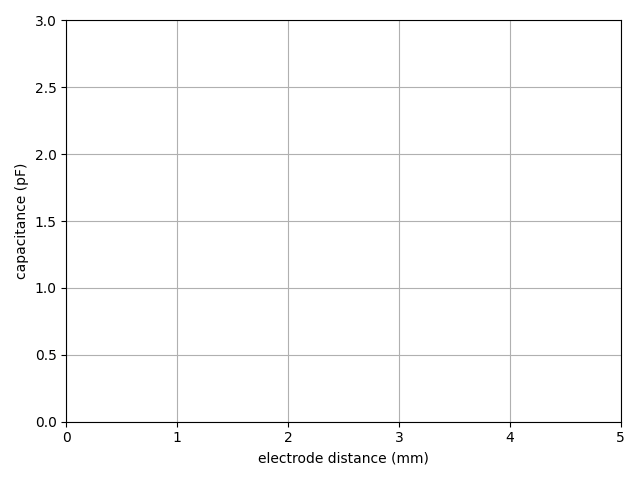

Demonstrations
--------------

### Busbar

["Electrical Heating in a Busbar"][busbar] is an example model used
in the tutorial in ["Introduction to Comsol Multiphysics"][intro] and
explained there in great detail. The section "Getting the Maximum and
Minimum Temperature" demonstrates how two obtain the two temperature
extremes within the Comsol GUI.

The following Python code does the same thing programmatically:
```python
import mph

client = mph.start()
model = client.load('busbar.mph')
model.solve()

(x, y, z, T) = model.evaluate(['x', 'y', 'z', 'T'])
(Tmax, Tmin) = (T.max(), T.min())
(imax, imin) = (T.argmax(), T.argmin())
print(f'Tmax = {T.max():.2f} K at ({x[imax]:5f}, {y[imax]:5f}, {z[imax]:5f})')
print(f'Tmin = {T.min():.2f} K at ({x[imin]:5f}, {y[imin]:5f}, {z[imin]:5f})')
```

This outputs the exact same numbers that appear in the table of the GUI:
```none
Tmax = 330.42 K at (0.105000, -0.024899, 0.053425)
Tmin = 322.41 K at (0.063272, 0.000000, 0.000000)
```

You could now sweep the model's parameters, for example the length (`L`)
or width (`wbb`) of the busbar.


[busbar]: https://www.comsol.com/model/electrical-heating-in-a-busbar-10206
[intro]: https://www.comsol.com/documentation/IntroductionToCOMSOLMultiphysics.pdf


### Compacting models

We usually save models to disk after we have solved them, which
includes the solution and mesh data in the file. This is convenient
so that we can come back to the model later, but don't have to run
the simulation again, which may take a long time. However, the files
then require a lot of disk space. After a while, we may want to archive
the models, but trim the fat before we do that.

To compact all model files in the current folder, we can do this:
```python
import mph
from pathlib import Path

client = mph.start()
for file in Path.cwd().glob('*.mph'):
    print(f'{file}:')
    model = client.load(file)
    model.clear()
    model.save()
```

The script `compact_models.py` in the ["demos" folder][demos] of the
source-code repository is a more refined version of the above code.
It displays more status information and also resets the modeling
history.

Note that we could easily go through all sub-directories recursively
by replacing `glob` with `rglob`. However, this should be used with
care so as to not accidentally modify models in folders that were not
meant to be included.


[demos]: https://github.com/John-Hennig/MPh/tree/master/demos


### Multiple processes

As explained in [Limitations](limitations), we cannot run more than
one Comsol session inside the same Python process. But we *can* start
multiple Python processes in parallel, thanks to the
[multiprocessing][multi] module that is part of the standard library.

So, other than MPh itself, we are going to need `multiprocessing`,
as well as `queue`, also from the standard library, though only for
the `queue.Empty` exception type that it provides.
```python
import mph
import multiprocessing
import queue
```

In this demonstration, we will solve the model `capacitor.mph` from the
["tests" folder][tests] of the source-code repository, the same model
we used in the [Tutorial](tutorial). We want to sweep the electrode
distance d and calculate the capacitance C for each value of the
distance, ranging from 0.5 to 5 mm.
```python
values = [0.5, 1.0, 1.5, 2.0, 2.5, 3.0, 3.5, 4.0, 4.5, 5.0]
```

Next, we define the function that we intend to run in each of the
separate processes, i.e. in the "workers". It sets up the Comsol session
when the process starts, then keeps solving the model for each distance
value that it receives via a `jobs` queue. Each time, it evaluates the
solution and returns the capacitance via a `results` queue. It does
so until the `jobs` queue is exhausted, upon which the function
terminates, and with it Comsol session and Python process.
```python
def worker(jobs, results):
    client = mph.start(cores=1)
    model = client.load('capacitor.mph')
    while True:
        try:
            d = jobs.get(block=False)
        except queue.Empty:
            break
        model.parameter('d', f'{d} [mm]')
        model.solve('static')
        C = model.evaluate('2*es.intWe/U^2', 'pF')
        results.put((d, C))
```

Each worker will only use one of the processor cores available on the
machine, as that's the whole point: We want to achieve maximum speed-up
of, say, a parameter sweep, where each core works on a separate job
corresponding to one of the many parameter values.

We could also solve this sequentially, one parameter value at a time.
Comsol's solver could then make use of all cores and would also employ
some parallelization in its internal computation. But the speed-up would
not usually scale linearly with the number of cores, especially for
large numbers of them.

We might use a "parametric sweep", a feature that Comsol does offer.
But here we retain full programmatic control of which parameter is
solved for and when. The parameter values don't have to be hard-coded,
they could come from user input or be generated depending on the
outcome of the simulations themselves. For example, this approach
lends itself to iterative optimization solvers such as the "genetic
algorithm", where a batch of simulations would be run for each new
"generation".

Note that the returned results also contain the input parameter.
As processes will be run asynchronously in parallel, we cannot be sure
that output is returned in the order that input was fed in.

Before we start the computation, we add all parameter values to the
`jobs` queue:
```python
jobs = multiprocessing.Queue()
values = [0.5, 1.0, 1.5, 2.0, 2.5, 3.0, 3.5, 4.0, 4.5, 5.0]
for d in values:
    jobs.put(d)
```

We also have to provide the `results` queue, which is of course empty
in the beginning.
```python
results = multiprocessing.Queue()
```

Then we can start a number of workers, say four:
```python
for _ in range(4):
    process = Process(target=worker, args=(jobs, results)
    process.start()
```

It may be a good idea to hold on to the `process` objects and add them
to a list `processes`, just so that Python's garbage collection won't
accidentally delete them while the external processes are running.

Finally, still in the main process that starts all the workers, we
can collect the results. We use a `for` loop and exploit the fact
that there will be as many results as there were jobs to begin with.
```python
for _ in values:
    (d, C) = results.get()
```

We would then display them, plot them, save them to a file, or whatever
it is we do with simulation results.

The complete script `worker_pool.py`, which implements all of the above
and also works around a few issues not covered here for the sake of
brevity, can be found in the ["demos" folder][demos] of the source-code
repository. As it runs, it displays a live plot such as this one:



A more advanced implementation may use a class derived from `multiprocessing.Process` instead of a mere function, just to be able
so save state. For long-running simulations it would make sense to
store jobs and results on disk, rather than in memory, so that the
execution of the queue may be resumed after a possible interruption.
In that case, one may, or may not, find the [subprocess][subpr]
module more convenient for starting the external processes. The
workers would then be a separate module that is run as a script.


[multi]: https://docs.python.org/3/library/multiprocessing.html
[tests]: https://github.com/John-Hennig/MPh/tree/master/tests
[subpr]: https://docs.python.org/3/library/subprocess.html
